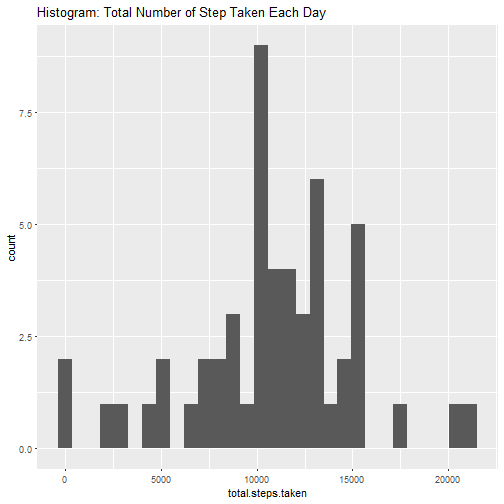
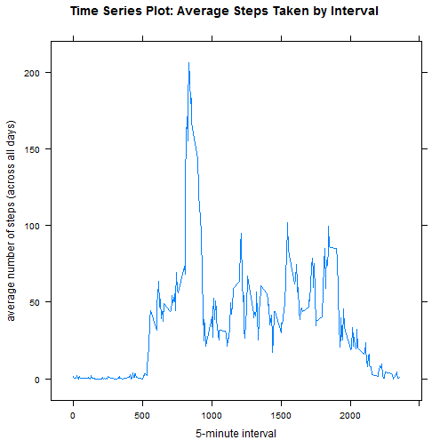
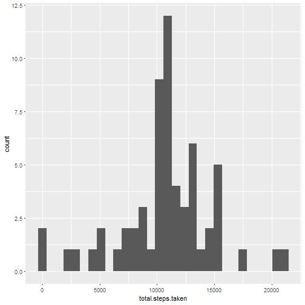
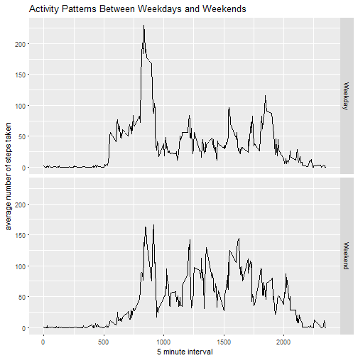

## Introduction

It is now possible to collect a large amount of data about personal
movement using activity monitoring devices such as a
[Fitbit](http://www.fitbit.com), [Nike
Fuelband](http://www.nike.com/us/en_us/c/nikeplus-fuelband), or
[Jawbone Up](https://jawbone.com/up). These type of devices are part of
the "quantified self" movement -- a group of enthusiasts who take
measurements about themselves regularly to improve their health, to
find patterns in their behavior, or because they are tech geeks. But
these data remain under-utilized both because the raw data are hard to
obtain and there is a lack of statistical methods and software for
processing and interpreting the data.

This assignment makes use of data from a personal activity monitoring
device. This device collects data at 5 minute intervals through out the
day. The data consists of two months of data from an anonymous
individual collected during the months of October and November, 2012
and include the number of steps taken in 5 minute intervals each day.

## Data

The data for this assignment can be downloaded from the course web
site:

* Dataset: [Activity monitoring data](https://d396qusza40orc.cloudfront.net/repdata%2Fdata%2Factivity.zip) [52K]

The variables included in this dataset are:

* **steps**: Number of steps taking in a 5-minute interval (missing
    values are coded as `NA`)

* **date**: The date on which the measurement was taken in YYYY-MM-DD
    format

* **interval**: Identifier for the 5-minute interval in which
    measurement was taken


The dataset is stored in a comma-separated-value (CSV) file and there
are a total of 17,568 observations in this
dataset.


## Assignment

This assignment will be described in multiple parts. You will need to
write a report that answers the questions detailed below. Ultimately,
you will need to complete the entire assignment in a **single R
markdown** document that can be processed by **knitr** and be
transformed into an HTML file.

Throughout your report make sure you always include the code that you
used to generate the output you present. When writing code chunks in
the R markdown document, always use `echo = TRUE` so that someone else
will be able to read the code. **This assignment will be evaluated via
peer assessment so it is essential that your peer evaluators be able
to review the code for your analysis**.

For the plotting aspects of this assignment, feel free to use any
plotting system in R (i.e., base, lattice, ggplot2)

Fork/clone the [GitHub repository created for this
assignment](http://github.com/rdpeng/RepData_PeerAssessment1). You
will submit this assignment by pushing your completed files into your
forked repository on GitHub. The assignment submission will consist of
the URL to your GitHub repository and the SHA-1 commit ID for your
repository state.

NOTE: The GitHub repository also contains the dataset for the
assignment so you do not have to download the data separately.


### Loading and preprocessing the data

Show any code that is needed to

Question #1.  Load the data (i.e. **read.csv()**)


```r
if (!file.exists("data")) {
  dir.create("data")
}
## Download the data and load into the activity Dataframe 
fileUrl <- "https://d396qusza40orc.cloudfront.net/repdata%2Fdata%2Factivity.zip"
download.file(fileUrl,destfile="./Data/ActivityMonitoringDataset.zip")
unzip(zipfile="./Data/ActivityMonitoringDataset.zip", exdir = "./Data")
activity = read.csv("./data/activity.csv")  # read csv file
```

Question #2.  Process/transform the data (if necessary) into a format suitable for your analysis


```r
## Create the activity dataframe and view it's structure and contents
activity = read.csv("./data/activity.csv")  # read csv filesummary(activity)
str(activity)
```

```
## 'data.frame':	17568 obs. of  3 variables:
##  $ steps   : int  NA NA NA NA NA NA NA NA NA NA ...
##  $ date    : Factor w/ 61 levels "2012-10-01","2012-10-02",..: 1 1 1 1 1 1 1 1 1 1 ...
##  $ interval: int  0 5 10 15 20 25 30 35 40 45 ...
```

```r
head(activity)
```

```
##   steps       date interval
## 1    NA 2012-10-01        0
## 2    NA 2012-10-01        5
## 3    NA 2012-10-01       10
## 4    NA 2012-10-01       15
## 5    NA 2012-10-01       20
## 6    NA 2012-10-01       25
```

```r
library(dplyr)
## Rearrange columns in a logical time series format
activity <- select(activity, date, interval, steps)
```


```r
head(activity)
```

```
##         date interval steps
## 1 2012-10-01        0    NA
## 2 2012-10-01        5    NA
## 3 2012-10-01       10    NA
## 4 2012-10-01       15    NA
## 5 2012-10-01       20    NA
## 6 2012-10-01       25    NA
```


### What is mean total number of steps taken per day?

For this part of the assignment, you can ignore the missing values in the dataset.

```r
activity.noNAs <- na.omit(activity)
```

Question #1.  Calculate the total number of steps taken per day

```r
steps.per.day <- activity.noNAs %>% group_by(date) %>% 
  summarize(total.steps.taken=sum(steps))
head(steps.per.day)
```

```
## # A tibble: 6 × 2
##         date total.steps.taken
##       <fctr>             <int>
## 1 2012-10-02               126
## 2 2012-10-03             11352
## 3 2012-10-04             12116
## 4 2012-10-05             13294
## 5 2012-10-06             15420
## 6 2012-10-07             11015
```

Question #2.  If you do not understand the difference between a histogram and a barplot, research the difference between them.  Make a histogram of the total number of steps taken each day


```r
library(ggplot2)
ggplot(data=steps.per.day, aes(total.steps.taken)) + 
      geom_histogram() +
      ggtitle("Histogram: Total Number of Step Taken Each Day")
```

```
## `stat_bin()` using `bins = 30`. Pick better value with `binwidth`.
```



Question #3.  Calculate and report the **mean** and **median** total number of steps taken per day


```r
mean(steps.per.day$total.steps.taken)
```

```
## [1] 10766.19
```

```r
median(steps.per.day$total.steps.taken)
```

```
## [1] 10765
```


### What is the average daily activity pattern?
Question #1.  Make a time series plot (i.e. type = "l") of the 5-minute interval (x-axis) and the average number of steps taken, averaged across all days (y-axis)


```r
library(lattice)
steps.by.interval <- activity.noNAs %>% group_by(interval) %>% 
  summarize(average.steps = mean(steps))
xyplot(average.steps ~ interval, steps.by.interval, type="l",
        xlab="5-minute interval", 
        ylab="average number of steps (across all days)",
        main="Time Series Plot: Average Steps Taken by Interval")
```



Question #2.  Which 5-minute interval, on average across all the days in the dataset, contains the maximum number of steps?


```r
filter(steps.by.interval, average.steps == max(average.steps))
```

```
## # A tibble: 1 × 2
##   interval average.steps
##      <int>         <dbl>
## 1      835      206.1698
```

### Imputing missing values

Note that there are a number of days/intervals where there are missing values (coded as NA). The presence of missing days may introduce bias into some calculations or summaries of the data.

Question #1.  Calculate and report the total number of missing values in the dataset (i.e. the total number of rows with NAs)


```r
sum(is.na(activity$steps) == TRUE)
```

```
## [1] 2304
```

Question #2.  Devise a strategy for filling in all of the missing values in the dataset. The strategy does not need to be sophisticated. For example, you could use the mean/median for that day, or the mean for that 5-minute interval, etc.

```r
## The strategy will be to fill in missing values (NAs) by using the means for 5-minute intervals.  The steps.by.interval dataframe witll be leveraged
```

Question #3.  Create a new dataset that is equal to the original dataset but with the missing data filled in.


```r
activity.imputed <- merge(activity, steps.by.interval, by="interval")
head(activity.imputed)
```

```
##   interval       date steps average.steps
## 1        0 2012-10-01    NA      1.716981
## 2        0 2012-11-23     0      1.716981
## 3        0 2012-10-28     0      1.716981
## 4        0 2012-11-06     0      1.716981
## 5        0 2012-11-24     0      1.716981
## 6        0 2012-11-15     0      1.716981
```

```r
##Function to replace steps NAs 
for (i in 1:nrow(activity.imputed)) {
  if (is.na(activity.imputed[i,3]== TRUE)) {
      activity.imputed$steps[i]=
      activity.imputed$average.steps[i]
  }
}
head(activity.imputed)
```

```
##   interval       date    steps average.steps
## 1        0 2012-10-01 1.716981      1.716981
## 2        0 2012-11-23 0.000000      1.716981
## 3        0 2012-10-28 0.000000      1.716981
## 4        0 2012-11-06 0.000000      1.716981
## 5        0 2012-11-24 0.000000      1.716981
## 6        0 2012-11-15 0.000000      1.716981
```

```r
##Remove the average.steps column - no longer needed
 activity.imputed$average.steps=NULL
 head(activity.imputed)
```

```
##   interval       date    steps
## 1        0 2012-10-01 1.716981
## 2        0 2012-11-23 0.000000
## 3        0 2012-10-28 0.000000
## 4        0 2012-11-06 0.000000
## 5        0 2012-11-24 0.000000
## 6        0 2012-11-15 0.000000
```

```r
##Rearrange the dataframe
activity.imputed <- select(activity.imputed, date, interval, steps)
activity.imputed <- arrange(activity.imputed, date)
head(activity.imputed)
```

```
##         date interval     steps
## 1 2012-10-01        0 1.7169811
## 2 2012-10-01        5 0.3396226
## 3 2012-10-01       10 0.1320755
## 4 2012-10-01       15 0.1509434
## 5 2012-10-01       20 0.0754717
## 6 2012-10-01       25 2.0943396
```

```r
##Confirm all NAs were imputed
sum(is.na(activity.imputed$steps)==TRUE)
```

```
## [1] 0
```
Question #4.  Make a histogram of the total number of steps taken each day and Calculate and report the mean and median total number of steps taken per day. Do these values differ from the estimates from the first part of the assignment? What is the impact of imputing missing data on the estimates of the total daily number of steps?


```r
imputed.steps.per.day <- activity.imputed %>% group_by(date) %>% 
  summarize(total.steps.taken=sum(steps))
head(imputed.steps.per.day)
```

```
## # A tibble: 6 × 2
##         date total.steps.taken
##       <fctr>             <dbl>
## 1 2012-10-01          10766.19
## 2 2012-10-02            126.00
## 3 2012-10-03          11352.00
## 4 2012-10-04          12116.00
## 5 2012-10-05          13294.00
## 6 2012-10-06          15420.00
```

```r
## Create the histogram
library(ggplot2)
ggplot(data=imputed.steps.per.day, aes(total.steps.taken)) + geom_histogram()
```

```
## `stat_bin()` using `bins = 30`. Pick better value with `binwidth`.
```



```r
## Calculate and report the mean and median total number of steps ## taken per day.
mean(imputed.steps.per.day$total.steps.taken)
```

```
## [1] 10766.19
```

```r
median(imputed.steps.per.day$total.steps.taken)
```

```
## [1] 10766.19
```
Do these values differ from the estimates from the first part of the assignment? 

```r
## The mean is the same while the median has increased
```

What is the impact of imputing missing data on the estimates of the total daily number of steps? 

```r
## The median changed/increased but the distribution is the same.
```

### Are there differences in activity patterns between weekdays and weekends?

For this part the weekdays() function may be of some help here. Use the dataset with the filled-in missing values for this part.

Question #1.  Create a new factor variable in the dataset with two levels - "weekday" and "weekend" indicating whether a given date is a weekday or weekend day.


```r
## Use the weekdays() function to create the DayOfWeek variable
activity.imputed <- mutate(activity.imputed,DayOfWeek=
  weekdays(as.Date(activity.imputed$date)))
head(activity.imputed)
```

```
##         date interval     steps DayOfWeek
## 1 2012-10-01        0 1.7169811    Monday
## 2 2012-10-01        5 0.3396226    Monday
## 3 2012-10-01       10 0.1320755    Monday
## 4 2012-10-01       15 0.1509434    Monday
## 5 2012-10-01       20 0.0754717    Monday
## 6 2012-10-01       25 2.0943396    Monday
```

```r
## Create function to translate DayOfWeek to Weekend or Weekday
for (i in 1:nrow(activity.imputed)) {
  if (activity.imputed[i,"DayOfWeek"] == "Saturday" || activity.imputed[i,"DayOfWeek"] == "Sunday") {
      activity.imputed[i,"TypeOfDay"] = "Weekend"
 }else {
      activity.imputed[i,"TypeOfDay"] = "Weekday"
    }
}
head(activity.imputed)
```

```
##         date interval     steps DayOfWeek TypeOfDay
## 1 2012-10-01        0 1.7169811    Monday   Weekday
## 2 2012-10-01        5 0.3396226    Monday   Weekday
## 3 2012-10-01       10 0.1320755    Monday   Weekday
## 4 2012-10-01       15 0.1509434    Monday   Weekday
## 5 2012-10-01       20 0.0754717    Monday   Weekday
## 6 2012-10-01       25 2.0943396    Monday   Weekday
```

```r
## Create summary dataframe for ave steps by interval/TypeOfDay
steps.by.interval.act.imputed <- activity.imputed %>% 
  group_by(TypeOfDay, interval) %>%   
  summarize(average.steps = mean(steps))

## View he dataframe
head(steps.by.interval.act.imputed)
```

```
## Source: local data frame [6 x 3]
## Groups: TypeOfDay [1]
## 
##   TypeOfDay interval average.steps
##       <chr>    <int>         <dbl>
## 1   Weekday        0    2.25115304
## 2   Weekday        5    0.44528302
## 3   Weekday       10    0.17316562
## 4   Weekday       15    0.19790356
## 5   Weekday       20    0.09895178
## 6   Weekday       25    1.59035639
```

Question #2.  Make a panel plot containing a time series plot of the 5-minute interval (x-axis) and the average number of steps taken, averaged across all weekday days or weekend days (y-axis)


```r
ggplot(data = steps.by.interval.act.imputed, 
  aes(x=interval, y=average.steps)) +
  geom_line() +
  facet_grid(TypeOfDay ~ .) +
  xlab("5 minute interval") + 
  ylab("average number of steps taken") +
  ggtitle("Activity Patterns Between Weekdays and Weekends")
```


